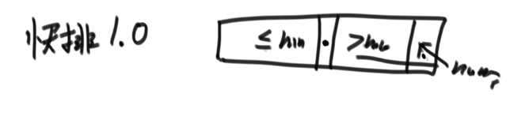

## 1. 复杂度和简单的排序算法

### 1.1 时间复杂度

常数操作：一个操作如果和样本的数据量没有关系，每次都是固定时间内完成的操作，叫做常数操作。

时间复杂度为一个算法流程中，常数操作数量的一个指标。常用O(读作big O)来表示。具体来说，先要对一个算法流程非常熟悉，然后去写出这个算法流程中，
发生了多少常数操作， 进而总结出常数操作数量的表达式。在表达式中，只要高阶项，不要低阶项，也不要高阶项的系数，剩下的部分如果为f(N)，那么时间复杂度为O(f(N))。

### 1.2 空间复杂度

如果算法执行所需要的临时空间不随着某个变量n的大小而变化，即此算法空间复杂度为一个常量，可表示为 S(n) = O(1)，反之则为O(n)

例如：
```java
int[] m = new int[n]
for(i=1; i<=n; ++i)
{
   j = i;
   j++;
}
```
这段代码中，第一行new了一个数组出来，这个数据占用的大小为n，这段代码的2-6行，虽然有循环，但没有再分配新的空间，因此，这段代码的空间复杂度主要看第一行即可，即 S(n) = O(n)

### 1.3 选择排序

思想：从左到右，便历每一个元素，再从该元素的下一个元素开始，便历每一个元素与其比较，如果后面元素小于前面，互换位置。

```go
package main

//正序
func selectSort(arr []int) []int {
	for i:=0;i<len(arr)-1;i++{
		for j:=i+1;j<len(arr);j++{
			if arr[j]<arr[i]{
				arr[i] = arr[j]
				arr[j] = arr[i]
            }
        }
    }
	return arr
}


```

### 1.4 冒泡排序

思想：从左到右，便历每一个元素与其下一个元素比较，后者大于前者，就互换位置。

```go
package main

//正序
func bubbleSort(arr []int) []int {
	if len(arr) < 2 {
		return arr
	}
	for e := len(arr) - 1; e > 0; e-- {
		for i := 0; i < e; i++ {
			if arr[i] > arr[i+1] {
				arr[i], arr[i+1] = arr[i+1], arr[i]
			}
		}
	}
	return arr
}
```
### 1.5 异或

相同则为0，不同则为1。也可以理解为不进位的二进制相加。

公式：
（1）0^N = N
（2）N^N = 0
（3）满足交换律和结合律：a^b = b^a a^b^c = a^(b^c)
（4）N个数的异或结果与顺序无关：a^b^c = a^c^b = b^a^c = ...

#### 1.5.1 用位运算交换2个数的位置？

```go
a := 2
b := 3

a = a^b
b = a^b
a = a^b
```
思路：b = a^b^b = a^0 =a; a= a^b = a^b^a = b

#### 1.5.2 案例
- a.一个整数数组中，其中有一个数出现的次数为奇数个，其他均出现偶数次，找出这个出现次数为奇数的元素？

eor = a^b^c^d^... eor即为这个元素。
偶数次数的元素异或为0，0与任何数异或均为任何数，所以eor为这个数。

- b.其中有两个个数出现的次数为奇数个元素，其他均出现偶数次？找出这两个出现次数为奇数的元素？

分析：
所有元素位运算的结果eor := a^b（这2个元素的位运算结果），因为a!=b,所以eor !=0;
假设eor第8位字节为1（a和b第8个字节不同），找出第8位字节为1的所有元素位运算结果eor2 = a或者b;
eor ^ eor 2 = b或者a;

代码：
```go
package main

func findAB(arr []int) []int {
	eor := arr[0]
	for i:=1;i<len(arr);i++{
		eor ^= arr[i]
    }
	//eor必然有一个字节为1
	rightOne := eor ^ （~ eor + 1） //本身和本身的取反加1得到最右侧的1
	eor2 := 0
	for i:=0;i<len(arr);i++{
		if rightOne ^ arr[i] == 0 {
			eor2 ^= arr[i]//找出这个字节位置为1的所有数，因为其他数字为偶数个，只有a或者b为奇数个，所以eor2为a,或者b
        }
    }
	eor1 :=eor ^ eor2 
	return []int{eor1,eor2}
}
```

### 1.6 插入排序

思路：从第二个元素开始便历，当前元素与前面的元素比较，后者比前者大就交换位置，继续往前，直至到数组最前或者当前元素大于前面元素。

代码：
```go
package main

//正序
func InsertSort(arr []int) []int {
    for i:=1;i<len(arr);i++{
		j:=i
		for j>0 && arr[j]<arr[j-1]{
			swap(arr,j,j-1)
			j--
        }
    }
	return arr
}
func swap(arr []int,a,b int) []int {
    arr[a] = arr[a]^arr[b]
    arr[b] = arr[a]^arr[b]
    arr[a] = arr[a]^arr[b]
	return arr
}
```

### 1.7 二分法

二分法的时间复杂度：logN

#### 1.7.1 在一个有序数组里面找出是否存在某个数字？

```go
package main
func erFen(arr []int,a int) int {
    var midIndex int
	if len(arr)%2 != 0 {
		midIndex = (len(arr) -1) / 2
    }else{
		midIndex = len(arr) / 2
    }
	if arr[midIndex] == a {
		return midIndex
    }else if arr[midIndex] > a{
        return erFen(arr[0:midIndex],a)		
    }else{
		return erFen(arr[midIndex+1:len(arr)],a)
	}
}
```


#### 1.7.2 在一个有序数组里面找出>=某个数出现在数组最左侧的位置？

和上题类似

#### 1.7.3 无序数组的局部最小值问题？

局部最小：对于0位置数，arr[0]<arr[1],0就是局部最小；对于n-1位置数，如果arr[n-1]<arr[n-2],n局部最小；对于i位置，arr[i]<arr[i-1]&&arr[i]<arr[i+1],i局部最小。


### 1.8 递归

#### 1.8.1 剖析递归行为和递归行为时间复杂度的估算
#### 1.8.2 用递归方法找一个数组中的最大值，系统上到底是怎么做的?

```go
package main

func diGui(arr []int, i, j int) int {
	if i == j {
		return arr[i]
	}
	mid := i + (j-i)>>1
	leftMax := diGui(arr, i, mid)
	rightMax := diGui(arr, mid+1, j)
	
	bigInt := leftMax
	if leftMax < rightMax {
		bigInt = rightMax
    }
	return bigInt
}
```

master公式的使用：
```text
T(N) = a*T(N/b) + O(N^d)// T：子调用（a:子调用次数，N/b子调用的复杂度，子问题等规模）；O(Nd):除去子调用的时间复杂度
1) log(b,a) > d -> 复杂度为O(N^log(b,a)) 
2) log(b,a) = d -> 复杂度为O(N^d * logN)
3) log(b,a) < d -> 复杂度为O(N^d)
```

### 1.9 归并排序

思路：先一分为二，左侧排好序，右侧排好序，再两边merge.

```go
package main

func process(arr []int, i, j int) []int {
	if i == j {
		return arr
	}
	mid := i + (j-i)>>1
	process(arr, i, mid)
	process(arr, mid+1, j)
	merge(arr,i,mid,j)
	return arr
}

func merge(arr []int, i, mid, j int) {
	newArr := make([]int, 0, j-i+1) //定义一个数组能装i到j这么长的元素
	p1 := i
	p2 := mid + 1
	for p1 <= mid && p2 <= j {
		if arr[p1] > arr[p2] {
			newArr = append(newArr, arr[p2])
			p2++
		} else {
			newArr = append(newArr, arr[p1])
			p1++
		}
	}
	for p1 <= mid {
		newArr = append(newArr, arr[p1])
		p1++
	}
	for p2 <= mid {
		newArr = append(newArr, arr[p2])
		p2++
	}

	for m := 0; m < len(newArr); m++ {
		arr[i+m] = newArr[m]
	}
}
```

时间复杂度为O(N*logN),空间复杂度为O(N)。优于选择、冒泡、插入排序。原因是选择、冒泡和插入排序每次比较之后就丢弃，浪费了，但是归并排序每次比较会沿用下去。

#### 1.9.1 小和问题

- 问题：
在一个数组中，每一个数左边比当前数小的数累加起来，叫做这个数组的小和。求一个数组的小和。
- 例子:
[1,3,4,2,5] 1左边比1小的数，没有; 3左边比3小的数，1; 4左 边比4小的数，1、3; 2左边比2小的数，1; 5左边比5小的数，1、3、4、 2; 所以小和为1+1+3+1+1+3+4+2=16

- 思路：等同于一个数右边有几个数比他大。如上数组，比如3，右边有4，,5两个数比他大，就是2*3

- 代码：
```go
package main

func smallSum(arr []int) int {
    if len(arr) <2{
		return 0
    }
	return process(arr,0,len(arr)-1)
}
//arr[l...r]既要排好序，也要求小和
func process(arr []int,l,r int) int {
    if l==r {
		return 0
    }
	mid := l+((r-l)>>1)
	return process(arr,l,mid)+process(arr,mid+1,r)+merge(arr,l,mid,r)
}
func merge(arr []int,mid,l,r int) int {
    newArr := make([]int,r-l+1)
	i := 0
	p1 := l
	p2 := mid+1
	res := 0
	for p1<=mid && p2 <= r {
		if arr[p1]<arr[p2]{
			res += arr[p1]*(r-p2+1)
			newArr[i+1] = min(arr[p1+1],arr[p2+1])
        }
    }
	for p1 <= mid {
		newArr[i+1] = arr[p1+1]
    }
	for p2 <= r {
		newArr[i+1] = arr[p2+1]
    }
	for m:=0;m<len(newArr);m++ {
		arr[l+m] = newArr[m]
    }
	return res
}

func min(a,b int) int {
    if a<b{
		return a
    }else{
		return b
    }
}


```

#### 1.9.2 逆序对问题

在一个数组中，左边的数如果比右边的数大，则这两个数构成一个逆序对，请打印所有逆序对。

思路：和如上问题等同，改动点：

```go
if arr[p1]>arr[p2]{
	res += r-p2+1
}
```

### 1.10 快排

时间复杂度 O(n*logN)
空间复杂度O(logN)

#### 1.10.1 快排1.0版本

取数组最右边的元素(a)作为临界值，把数组中其他的数，小于等于a的放在最左边，大于a的数放在右边，再把a与大于a的第一个元素交换。
此时，再让a所在的新位置左侧和右侧数组重复上述行为递归。


问题：给定一个数组arr，和一个数num，请把小于等于num的数放在数组的左边，大于num的数放在数组的右边。要求额外空间复杂度O(1)，时间复杂度O(N)

思路：
    （0）左侧划定一个小于num的区域
    （1）arr[i]<=num,arr[i]和小于num区域的下一个数交换，小于num区域右移，i++
    （2）arr[i]>num,i++
代码：

```go


```

#### 1.10.2 快排2.0版本(荷兰国旗问题)

取数组最右边的元素(a)作为临界值，把数组中其他的数，小于a的放在最左边，等于a的放在中间，大于a的数放在右边，再把a与大于a的第一个元素交换。
此时，等于a的数不用动了，小于a的数组和大于a的数组重复以上操作递归。

复杂度：O(N^2)

问题：给定一个数组arr，和一个数num，请把小于num的数放在数组的左边，等于num的数放在数组的中间，大于num的数放在数组的右边。要求额外空间复杂度O(1)，时间复杂度 O(N)

思路：
（0）左侧划定一个小于num的区域，右侧划定一个大于num的区域。
（1）arr[i]<num,arr[i]和小于num区域的下一个数交换，小于num区域右移，i++
（1）arr[i]==num,++
（2）arr[i]>num,arr[i]和大于num的区域前的一个数交换，大于num的区域左移动。i原地不动

代码：

```go


```

#### 1.10.3 快排3.0版本

思想：基于快排2.0版本，随机取一个数与数组最后一个数交换，再进行快排2.0的操作。

代码：

```go
package main

import "math"

func quickSort(arr []int) {
	if len(arr) < 2 {
		return
	}
	process(arr, 0, len(arr)-1)
}

//arr l-->r排序
func process(arr []int, l, r int) {
	//等概率选一个位置与末尾数交换
	if l < r {
		random := int(math.Round(float64((r-l+1)/len(arr)))) * len(arr) + l
		arr[random] = arr[random]^arr[r]
		arr[r] = arr[random]^arr[r]
		arr[random] = arr[random]^arr[r]
	}
	newArr := partition(arr,l,r)
	process(arr,l,newArr[0]-1)
	process(arr,newArr[1]+1,r)
}

//以arr[r]做划分，分为小于arr[r]区域，等于arr[r]区域，大于arr[r]区域
//返回等于划分值区域的左边界和右边界
func partition(arr []int, l, r int) []int {
    less := l-1//<区右边界
	more := r//>区左边界
	for l<more {
		if arr[l]<arr[r] {
			swap(arr,less+1,l)
			less ++
			l++
        }else if arr[l]>arr[r]{
			more --
			swap(arr,more,l)
        }else{
			l++
        }
    }
	swap(arr,more,r)
	return []int{less+1,more}
}

func swap(arr []int ,a,b int)  {
    arr[a] = arr[a]^arr[b]
    arr[b] = arr[a]^arr[b]
    arr[a] = arr[a]^arr[b]
	return
}

```

### 1.11 堆

#### 1.11.1 二叉树

满二叉树：二叉树存在右节点时，必定存在子节点。


i位置的左子节点是2*i+1
i位置的右子节点是2*i+2
i位置的父节点是(i-1)/2

二叉树的高度：
n个数的高度logN

#### 1.11.2 堆的介绍

大根堆：每个位置的头结点是整个树中最大的值。


小根堆：每个位置的头结点是整个树中最小的值。

heapSize = 节点个数
堆中最大的节点：头结点

#### 1.11.3 heapInsert

问题：数组接收一个数，使其形成一个新的堆？

思路：
    （1）heapSize加1，把新数放到堆尾的节点上。
    （2）和父节点比较，如果父节点比该数小就交换，以此类推，直至父节点比其大或者没有父节点了。

heapInsert代码：
```go
package main

func heapInsert(arr []int ,index int)  {
    for arr[index] > arr [(index -1) /2] {
		swap(arr,index,(index-1)/2)
		index = (index-1)/2
    }
}

func swap(arr []int,a,b int)  {
    arr[a] = arr[a] ^ arr[b]
    arr[b] = arr[a] ^ arr[b]
    arr[a] = arr[a] ^ arr[b]
}

```

#### 1.11.3 heapify

问题：如何取出大根堆的头结点？

思路：
    （1）取出头节点，把最后一个节点的数放在头结点上，heapSize减1。
    （2）然后把头结点的数和两个子节点中最大的数比较，比较大子节点还大就交换位置，以此操作，直至没有子节点或者比子节点都小。这个过程叫做heapify.

heapify代码:

```go
package main

func heapify(arr []int, index, heapSize int) {
	left := index*2 + 1
	for left < heapSize {
		//取出2个子节点中最大的节点位置
		biggerChild := left
		if left + 1 <heapSize && arr[left+1]>arr[left]{
			biggerChild = left +1
        }
		//把当前节点的数和子节点较大的数比较
		if arr[biggerChild] < arr[index]{
			biggerChild = index
        }
		if biggerChild == index {
			break
        }
		//交换位置
		swap(arr,biggerChild,index)
		index = biggerChild
		left = index * 2 +1
	}
}

func swap(arr []int,a,b int)  {
	arr[a] = arr[a] ^ arr[b]
	arr[b] = arr[a] ^ arr[b]
	arr[a] = arr[a] ^ arr[b]
}

```

综合：把一个连续区域内，把i位置的节点的数修改后，依然是堆？
思路：i位置数变小了，heapify过程；i位置数变大了，heapInsert过程。依然是堆结构。
代码实现：
```go
package main
func edit(arr []int, index, value int) {
	if index >= len(arr) || index <= 0 {
		return
	}
	heapSize := len(arr)
	if value < arr[index] {
		arr[index] = value
		heapify(arr, index, heapSize)
		return
	}
	if value > arr[index] {
		arr[index] = value
		heapInsert(arr, index)
		return
	}
	return
}
```

#### 1.11.4 堆排序

思路：
1，先让整个数组都变成大根堆结构，建立堆的过程: 
    1)从上到下的方法，时间复杂度为O(N*logN) 
    2)从下到上的方法，时间复杂度为O(N)
2，把堆的最大值和堆末尾的值交换，然后堆的大小减1。之后，再去调整堆heapfify。
3，一直周而复始，时间复杂度为O(N*logN) 3，堆的大小减小成0之后，排序完成

代码实现：

```go
package main

func heapSort(arr []int) {
	if len(arr)<2 {
		return
    }
	//把数组放入一个大根堆里面
	for i:=0;i<len(arr);i++ {
		heapInsert(arr,i)
    }
	heapSize := len(arr)
	//0位置的数和最后位置数交换
	swap(arr,0,heapSize-1)
	//再把0位置数heapSize
	for heapSize>0 {
		heapify(arr,0,heapSize)
		swap(arr,0,heapSize-1)
    }
}

func swap(arr []int,a,b int)  {
	arr[a] = arr[a] ^ arr[b]
	arr[b] = arr[a] ^ arr[b]
	arr[a] = arr[a] ^ arr[b]
}
```
#### 1.11.5 堆排序扩展

已知一个几乎有序的数组，几乎有序是指，如果把数组排好顺序的话，每个元素移动的距离可以不超过k，并且k相对于数组来说比较小。
请选择一个合适的排序算法针对这个数据进行排序。


说明：
    （1）数组转为小根堆：和大根堆方式相反。
    （2）使用堆结构有两种方式，一、自己构建的堆，可以更灵活使用。二、使用语言级的堆包，只有push和pop两种接口，不支持复杂操作。

代码实现：

```go
package main

import (
	"container/heap"
	"math"
)

type MyHeap []int

func (m MyHeap) Len() int {
	return len(m)
}

//如果实现大顶堆，则需要调整一下Less函数
func (m MyHeap) Less(i, j int) bool {
	if m[i] < m[j] {
		return true
	}
	return false
}

func (m MyHeap) Swap(i, j int) {
	m[i], m[j] = m[j], m[i]
}

func (m *MyHeap) Push(x any) {
	*m = append(*m, x.(int))
}

func (m *MyHeap) Pop() any {
	val := (*m)[len(*m)-1]
	*m = (*m)[:len(*m)-1]
	return val
}

func sortedArrDistanceLessK(arr []int, k int) {
	//默认小根堆
	h := &MyHeap{arr}
	heap.Init(h)
	index := 0
	for ;index <= int(math.Min(float64(len(arr)),float64(k)));index ++ {
		h.add(arr[index])
    }
	//从头开始弹出数字，然后把k后面一个数加在heap中去
	i :=0
	for ;index<len(arr);{
        h.add(arr[index])
		arr[i] = h.poll()
		i++
		index++
	}
	//再把heap中数字一次弹出
	for len(h)>0 {
		arr[i+1] = h.poll()
    }
}
```

#### 1.11.6 比较器

思想：
    （1）返回负数的时候，第一个参数排在前面
    （2）返回正数的时候，第二个参数排在前面
    （3）返回0的时候，谁在前面无所谓

使用：
    1)比较器的实质就是重载比较运算符 
    2)比较器可以很好的应用在特殊标准的排序上 
    3)比较器可以很好的应用在根据特殊标准排序的结构上

```go
package main

type Student struct {
	Id int `json:"id"`
	Name string `json:"name"`
}

func main()  {
    myStudent := []Student{
		{Id: 1,Name: "aa"},
		{Id: 2,Name: "bb"},
    }
	IdAscending(&myStudent[0],&myStudent[1])
}
func IdAscending(testStudent1,testStudent2 *Student) int {
    return testStudent1.Id - testStudent2.Id
}

func mySort(myStudent []Student,IdAscending func(testStudent1,testStudent2 *Student)int)  {
    
}
```

### 1.12 桶排序

之前的排序都是基于比较的排序，桶排序不基于比较的排序。不基于比较的排序要基于数据状况，比如年龄（0~200）

#### 1.12.1 计数排序

先构建一个计数表0-200,把所有的年龄挂在这个计数器里面，比如0位置有7个，1位置有3个，再还原成顺序数组。


#### 1.12.2 基数排序


思路：
    （1）先构建0-9十个桶，把所有的数补齐成与最大位数的数字，左边加0。
    （2）然后从个位数开始入桶，个位为0的入0桶，个位为1的入1桶，全部入桶完成
    （3）把桶中的数字一次到出来，每个桶先进后出。
    （4）对十位、百位以及更高位的数字也重复以上操作。便可排序完成。

代码实现：
    （1）
```go
package main

func radixSort(arr []int,l,r,digit int)  {//最大数的位数
    radix := 10//词频数
	i,j := 0,0
	bucket := make([]int,r-l+1)
	for d:=1;d<=digit;d++{
		countArr := make([]int,10)//词频数组
		//入桶，此时词频数组里面的元素代表该数字出现的次数
		for i=l;i<=r;i++ {
			j = getDigit(arr[i],d)
			countArr[j]++
        }
		//把词频数组里面的元素从代表该数字出现的次数-->改为小于等于该数字的元素次数
		for i=1;i<radix;i++ {
			countArr[i] = countArr[i] + countArr[i-1]
        }
		
		//把桶里面的元素写入原数组的复刻数组中
		//比如countArr[4] = 8,说明d位上，数字小于等于4的数字一共有8个，从又到左便历，找到一个d位上为4的数字，则他一定位于第7位（0为首位），
		//把该数字放在复刻数组index为7的位置上，同时词频数组中的词频数减一，则为countArr[4] = 7
		for i= r;i>=l;i-- {
			j := getDigit(arr[i],d)
			bucket[countArr[j] -1] = arr[i]
			countArr[j]--
        }
		
    }
}
```
### 1.13 排序稳定性

|:-----:|:----- :|:----- :|:-----|
||时间复杂度|空间复杂度|稳定性|
|选择排序|O(N^2)|0(1)|×|
|冒泡排序|O(N^2)|0(1)|√|
|插入排序|O(N^2)|0(1)|√|
|归并排序|O(N*logN)|0(N)|√|
|快排|O(N*logN)|0(logN)|×|
|堆排|O(N*logN)|0(1)|×|


## 2.哈希表和有序表

### 2.1 哈希表的介绍

1)哈希表在使用层面上可以理解为一种集合结构 
2)如果只有key，没有伴随数据value，可以使用HashSet结构(C++中叫UnOrderedSet) 
3)如果既有key，又有伴随数据value，可以使用HashMap结构(C++中叫UnOrderedMap) 
4)有无伴随数据，是HashMap和HashSet唯一的区别，底层的实际结构是一回事 
5)使用哈希表增(put)、删(remove)、改(put)和查(get)的操作，可以认为时间复杂度为 O(1)，但是常数时间比较大 
6)放入哈希表的东西，如果是基础类型，内部按值传递，内存占用就是这个东西的大小 
7)放入哈希表的东西，如果不是基础类型，内部按引用传递，内存占用是这个东西内存地址的大小

### 2.2 有序表的介绍

1)有序表在使用层面上可以理解为一种集合结构 
2)如果只有key，没有伴随数据value，可以使用TreeSet结构(C++中叫OrderedSet)
3)如果既有key，又有伴随数据value，可以使用TreeMap结构(C++中叫OrderedMap) 
4)有无伴随数据，是TreeSet和TreeMap唯一的区别，底层的实际结构是一回事 
5)有序表和哈希表的区别是，有序表把key按照顺序组织起来，而哈希表完全不组织 
5)红黑树、AVL树、size-balance-tree和跳表等都属于有序表结构，只是底层具体实现不同 
6)放入有序表的东西，如果是基础类型，内部按值传递，内存占用就是这个东西的大小 
7)放入有序表的东西，如果不是基础类型，必须提供比较器，内部按引用传递，内存占用是这个东西内存地址的大小 
8)不管是什么底层具体实现，只要是有序表，都有以下固定的基本功能和固定的时间复杂度O(logN)

#### 2.2.1 有序表的固定操作

1)void put(K key, V value):将一个(key，value)记录加入到表中，或者将key的记录 更新成value。
2)V get(K key):根据给定的key，查询value并返回。
3)void remove(K key):移除key的记录。
4)boolean containsKey(K key):询问是否有关于key的记录。
5)K firstKey():返回所有键值的排序结果中，最左(最小)的那个。
6)K lastKey():返回所有键值的排序结果中，最右(最大)的那个。
7)K floorKey(K key):如果表中存入过key，返回key;否则返回所有键值的排序结果中， key的前一个。
8)K ceilingKey(K key):如果表中存入过key，返回key;否则返回所有键值的排序结果中， key的后一个。
以上所有操作时间复杂度都是O(logN)，N为有序表含有的记录数

## 3.链表

### 3.1 链表介绍

- 单链表的节点结构

```go
package main
type Node struct{
    Value string
	Next  *Node
}
```
由以上结构的节点依次连接起来所形成的链叫单链表结构。

- 双链表的节点结构

```go
type Node struct{
    Value string
	Next  *Node
	Last  *Node
}
```
由以上结构的节点依次连接起来所形成的链叫双链表结构。 
单链表和双链表结构只需要给定一个头部节点head，就可以找到剩下的所有的节点。

**面试时链表解题的方法论：**
1)对于笔试，不用太在乎空间复杂度，一切为了时间复杂度 
2)对于面试，时间复杂度依然放在第一位，但是一定要找到空间最省的方法

重要技巧: 1)额外数据结构记录(哈希表等) 2)快慢指针

### 3.2 打印链表公共部分

给定两个有序链表的头指针head1和head2，打印两个链表的公共部分。如果两个链表的长度之和为N，时间复杂度要求为O(N)，额外空间复 杂度要求为O(1)

思路：
    1）双指针，便历两个链表
    2）如果a链表当前位置小于b链表当前位置，a链表指针向后移动。
    3）如果a链表当前位置等于b链表当前位置，a链表指针和b链表指针同时向后移动。
    4）直至其中一个链表的指针超出范围。

### 3.3 回文链表

【题目】给定一个单链表的头节点head，请判断该链表是否为回文结构。 
【例子】1->2->1，返回true; 1->2->2->1，返回true;15->6->15，返回true; 1->2->3，返回false。 
【例子】如果链表长度为N，时间复杂度达到O(N)，额外空间复杂度达到O(1)。

方法一思路：
    1）快慢指针找到链表后半段，压入栈中
    2）便历新链表节点值和从栈中弹出的值对比，每一步都一样，则回文

方法二思路：
1）快慢指针便历链表，快指针走到最后一个时，以这个节点为头，让慢指针后面的反转成一个新链表，这个时候链表就被分为两个链表
2）便历两个链表，如果每个节点的值都一样则回文

```go
package main

type ListNode struct {
	Val  int
	Next *ListNode
}

func isPalindrome(head *ListNode) bool {
	var (
		leftList, rightList = &ListNode{}, &ListNode{}
		leftTail            = leftList
		fastTail, slowTail  = head, head
	)
	//左半边节点存入leftList
	for slowTail != nil && fastTail != nil {
		leftTail.Next = &ListNode{Val: slowTail.Val}
		leftTail = leftTail.Next

		//奇数链表fast.Next为nil,偶数链表的fast.Next,Next为nil
		slowTail = slowTail.Next
		if fastTail.Next != nil {
			fastTail = fastTail.Next.Next
		} else {
			break
		}
	}
	//反转右边节点
	rightList = reverseList(slowTail)

	//比较2个链表
	flag := true
	leftList = leftList.Next
	for leftList != nil && rightList != nil {
		if leftList.Val != rightList.Val {
			flag = false
			break
		}
		leftList = leftList.Next
		rightList = rightList.Next
	}
	return flag
}

func reverseList(head *ListNode) *ListNode {
	var prev, cur *ListNode = nil, head
	for cur != nil {
		nextTmp := cur.Next
		cur.Next = prev
		prev = cur
		cur = nextTmp
	}
	return prev
}


```


### 3.4 将单向链表按某值划分成左边小、中间相等、右边大的形式

【题目】给定一个单链表的头节点head，节点的值类型是整型，再给定一个整数pivot。
实现一个调整链表的函数，将链表调整为左部分都是值小于pivot的节点，中间部分都是值等于pivot的节点，右部分都是值大于pivot的节点。
【进阶】在实现原问题功能的基础上增加如下的要求 
【要求】调整后所有小于pivot的节点之间的相对顺序和调整前一样 
【要求】调整后所有等于pivot的节点之间的相对顺序和调整前一样 
【要求】调整后所有大于pivot的节点之间的相对顺序和调整前一样 
【要求】时间复杂度请达到O(N)，额外空间复杂度请达到O(1)。


思路：
    1）申明6个变量（SH小于pivot链表的头,ST小于pivot链表的尾，EH,ET,BH,BT）
    2）变量链表，判断节点值，把各个节点分别挂在小于，等于或者大于pivot的链表上
    3）把3个链表按照S->E->B顺序串起来

```go
package main

type ListNode struct {
	Val  int
	Next *ListNode
}

func partition(head *ListNode, x int) *ListNode {
	var (
		smallList, bigList = &ListNode{},&ListNode{}
		smallTail          = smallList
		bigTail            = bigList
	)
	for head != nil {
		if head.Val < x {
			smallTail.Next = &ListNode{Val: head.Val}
			smallTail = smallTail.Next
		} else {
			bigTail.Next = &ListNode{Val: head.Val}
			bigTail = bigTail.Next
		}
		head = head.Next
	}
	smallTail.Next = bigList.Next
	return smallList.Next
}

```

### 3.5 复制含有随机指针节点的链表

【题目】一种特殊的单链表节点类描述如下：
```go
package main

type Node struct {
	Value int
	Next *Node
	Rand *Node
}

```
rand指针是单链表节点结构中新增的指针，rand可能指向链表中的任意一个节点，也可能指向null。给定一个由Node节点类型组成的无环单链表的头节点 head，请实现一个函数完成这个链表的复制，并返回复制的新链表的头节点。
【要求】时间复杂度O(N)，额外空间复杂度O(1)

思路一：
    1）声明一个哈希表，便历旧链表节点，每个旧节点生成新节点
    2）旧节点作为key,新节点作为value,存入map中
    3）再便历旧链表，根据旧节点从map中得到新节点，然后通过next和rand串起来


思路二：
1）便历链表，在旧节点a上生成一个a1的新节点，a.Next = a1，然后原来a节点的next节点挂在a1节点后面
2）便历旧节点a，找到a的rand指向节点a2，那么a1.rand = a2.Next
3）再便历链表，取出新节点，串在一起，形成新的链表即为负责链表


### 3.6 两个单链表相交的一系列问题

【题目】给定两个可能有环也可能无环的单链表，头节点head1和head2。
请实现一个函数，如果两个链表相交，请返回相交的第一个节点。如果不相交，返回null
【要求】如果两个链表长度之和为N，时间复杂度请达到O(N)，额外空间复杂度 请达到O(1)。

**思路：**

1. 找到链表的第一个入环节点（2种方法：a:哈希表；b:快慢指针，首先f,s都位于head节点，f每次走两步，s每次走一步，f和s总会在环节点的某个位置相遇，
然后快指针回到头结点，后面f和s都以每次一步的步长移动，直达相遇，相遇点即为入环的开始节点）
2. 如果是无环链表，长链表先移动链表长度的差值，再一起移动，直至二者相交（节点地址相同）
3. a有环，b无欢。二者不可能相交
4. a,b都有环，有三种情况：

5. 如果loopA和loopB相等，则退化为五环链表的相交问题，参照第一点的方法二
6. 如果loopA不等于loopB,则便历2个链表，如果能相等，则是第4点情况3；如果不想交则为第4点情况1
```go
package main

type ListNode struct {
	Val  int
	Next *ListNode
}

//情况1和情况2的code示例
func A(loop1,loop2 *ListNode) *ListNode {
    cur1 := loop1.Next
	for cur1 != loop1 {
		if cur1 == loop2 {
			return loop1
        }
		cur1 = cur1.Next
    }
	return nil
}
```

## 4. 二叉树

### 4.1 二叉树节点结构

```go
package main
type Node struct {
	V int
	Left *Node
	Right *Node
}
```

根节点：最上面的节点；叶子节点：左右子节点都为nil的节点。

### 4.2 递归序

用递归和非递归两种方式实现二叉树的先序、中序、后序遍历 


1->2->4->4->4->2->5->5->5->2->1->3->6->6->6->3->7->7->7->3->1
可以看出每个节点都会被便历三次。

```go
package main

type Node struct {
	V int
	Left *Node
	Right *Node
}

func showTree(head *Node)  {
    if head == nil {
		return
    }
	showTree(head.Left)
	showTree(head.Right)
}
```
#### 4.2.1 先序

先序:对每颗子树，均遵循根节点-->左节点-->右节点

案例：如上图打印顺序：1->2->4->5->3->6->7

转换：递归序的每个节点第一次便历的时候打印。

代码：

```go
package main

import "fmt"

type Node struct {
	V     int
	Left  *Node
	Right *Node
}

func showTree(head *Node) {
	if head == nil {
		return
	}
	fmt.Println(head.V)//第一次来到节点的时候打印
	showTree(head.Left)
	showTree(head.Right)
}
```

#### 4.2.2 中序

中序:对每颗子树，均遵循左节点-->根节点-->右节点

案例：如上图打印顺序：4->2->5->1->6->3->7

转换：递归序的每个节点第二次便历的时候打印。

代码：

```go
package main

import "fmt"

type Node struct {
	V     int
	Left  *Node
	Right *Node
}

func showTree(head *Node) {
	if head == nil {
		return
	}
	showTree(head.Left)
	fmt.Println(head.V)//第二次来到节点的时候打印
	showTree(head.Right)
}
```

#### 4.2.3 后序

先序:对每颗子树，均遵循左节点-->右节点-->根节点

案例：如上图打印顺序：4->5->2->6->7->3->1

转换：递归序的每个节点第三次便历的时候打印。

代码：

```go
package main

import "fmt"

type Node struct {
	V     int
	Left  *Node
	Right *Node
}

func showTree(head *Node) {
	if head == nil {
		return
	}
	showTree(head.Left)
	showTree(head.Right)
	fmt.Println(head.V)//第三次来到节点的时候打印
}
```

### 4.3 非递归序

#### 4.3.1 先序


先序:对每颗子树，均遵循 根节点-->左节点-->右节点

执行步骤：
1. 从栈中弹出一个节点cur
2. 打印（处理）cur
3. 先右后左（如果有），把该节点的子节点压入栈中
4. 循环执行1->2->3

案例：如上图打印顺序：1->2->4->5->3->6->7


代码：

```go
package main

import "fmt"

type Node struct {
	V     int
	Left  *Node
	Right *Node
}

func showTree(head *Node) {
	if head != nil {
		nodeStack := make([]*Node,0,1)
		nodeStack = append(nodeStack,head)
		for len(nodeStack) != 0 {
			fmt.Println(nodeStack[len(nodeStack)-1])
			nodeStack = nodeStack[0:len(nodeStack)-2]
			if head.Right != nil {
				nodeStack = append(nodeStack,head.Right)
			}
			if head.Left != nil {
				nodeStack = append(nodeStack,head.Left)
            }
        }
    }
	
}
```

#### 4.3.2 中序

先序:对每颗子树，均遵循左节点-->根节点-->右节点

执行步骤：
0. 申请1个栈
1. 把每颗子树的整树所有左节点入栈
2. 依次弹出的过程中，打印该节点，且对该节点的右节点循环1，2,
3. 循环执行1->2->3
4. 打印收集栈中数据

案例：如上图打印顺序：4->2->5->1->6->3->7

代码：

```go
package main

import "fmt"

type Node struct {
	V     int
	Left  *Node
	Right *Node
}

func showTree(head *Node) {
	if head != nil {
		nodeStack := make([]*Node,0,1)
		for len(nodeStack) != 0 || head != nil {
			if head != nil {//所有左节点压入栈
				nodeStack = append(nodeStack,head)
				head = head.Left
            }else{//弹出栈的数据，打印节点，且对右子节点循环if的操作
				fmt.Println(nodeStack[len(nodeStack)-1])
				nodeStack = nodeStack[0:len(nodeStack)-2]
				head = head.Right
            }
		}
	}
}

```

#### 4.3.3 后序


后序:对每颗子树，均遵循 左节点-->右节点-->根节点

执行步骤：
0. 申请两个栈（普通栈和收集栈）
1. 从普通栈中弹出一个节点cur
2. 把该节点压入收集栈中
3. 先左后右（如果有），把该节点的子节点压入普通栈中
4. 循环执行1->2->3
5. 打印收集栈中数据

案例：如上图打印顺序：4->5->2->6->7->3->1

代码：

```go
package main

import "fmt"

type Node struct {
	V     int
	Left  *Node
	Right *Node
}

func showTree(head *Node) {
	if head != nil {
		nodeStack := make([]*Node,0,1)
		showStack := make([]*Node,0,1)
		nodeStack = append(nodeStack,head)
		for len(nodeStack) != 0 {
			showStack = append(showStack,nodeStack[len(nodeStack)-1])//当前节点压入收集栈
			nodeStack = nodeStack[0:len(nodeStack)-2]//弹出当前节点
			//左子节点压入栈
			if head.Left != nil {
				nodeStack = append(nodeStack,head.Left)
			}
			//右子节点压入栈
			if head.Right != nil {
				nodeStack = append(nodeStack,head.Right)
			}
        }
		//便利收集栈数据
		for _,v := range showStack {
			fmt.Println(v)
        }
    }
}
```

### 4.4 直观的打印一颗二叉树


### 4.5 二叉树的宽度优先遍历

做法：使用队列（先进先出）

思路：
0. 申请一个队列
1. 把头结点加入队列
2. 从队列中弹出一个节点cur，并打印
3. 先左后右（如果有），把该节点的子节点加入队列
4. 循环执行2->3

代码：

```go
package main

import "fmt"

type Node struct {
	Value int
	Left  *Node
	Right *Node
}

func wideTraverse(head *Node) {
	nodeQueue := make([]*Node, 0, 1)
	nodeQueue = append(nodeQueue, head)
	for len(nodeQueue) > 0 {
		cur := nodeQueue[0]
		fmt.Println(cur)
		nodeQueue = nodeQueue[1:len(nodeQueue)]
		if cur.Left != nil {
			nodeQueue = append(nodeQueue, cur.Left)
        }
		if cur.Right != nil {
			nodeQueue = append(nodeQueue, cur.Right)
		}
	}
}
```

例题:求一棵二叉树的宽度

思路：以上宽度便历算法中，如果知道每个节点属于第几层，就能求出每层数据个数，最大值即为二叉树宽度

```go
package main

import "fmt"

type Node struct {
	Value int
	Left  *Node
	Right *Node
}

func wide(head *Node) int {
	maxLevelNodeNum := 0 //最大的层级节点个数（二叉树宽度）
	
	nodeQueue := make([]*Node, 0, 1)//声明一个队列存放节点
	levelMap := make(map[*Node]int,1)//map记录每个节点的层级
	nodeQueue = append(nodeQueue, head)//头节点加入队列
	levelMap[head] = 1//头结点层级
	
	curLevel := 1 //当前层级
	curLevelNodeNum := 0 //当前层级的节点个数
	for len(nodeQueue) > 0 {
		cur := nodeQueue[0]//找到需要弹出的节点
		curNodeLevel := levelMap[cur]//查出当前节点的层级
		if curNodeLevel == curLevel {//当前节点的层级和当前层一样，当前层级节点数加一
			curLevelNodeNum++
        }else{//当前节点的层级和当前层不一样，说明到下一层了，当前层级加一，当前层级节点数置为1
			maxLevelNodeNum = max(maxLevelNodeNum,curLevelNodeNum)
			curLevel++
			curLevelNodeNum = 1
        }
		fmt.Println(cur)
		nodeQueue = nodeQueue[1:len(nodeQueue)]
		if cur.Left != nil {
			levelMap[cur.Left] = curNodeLevel+1//加入左节点，左节点的层级较当前节点的层级加一
			nodeQueue = append(nodeQueue, cur.Left)
        }
		if cur.Right != nil {
			levelMap[cur.Right] = curNodeLevel+1////加入右节点，左节点的层级较当前节点的层级加一
			nodeQueue = append(nodeQueue, cur.Right)
		}
	}
	return maxLevelNodeNum
}

func max(a,b int) int {
	maxNum := a
	if a<b {
		maxNum =b
    }
	return maxNum
}
```

### 4.6 二叉树的深度优先遍历

深度优先遍历即为先序遍历

### 4.7 搜索二叉树

定义：每一个子树，左节点比根节点小，右节点比根节点大的二叉树，二叉树的节点无重复值。

思路：中序（递归中序或者非递归中序均可）遍历二叉树，如果是升序的即为搜索二叉树。

代码：递归中序方法（非递归方法也可，此处代码省略）

```go
package main

import (
	"math"
)

type Node struct {
	Value int
	Left  *Node
	Right *Node
}

var preValue int = math.MinInt64

func isBST(head *Node) bool {
	if head == nil {
		return true
	}
	leftBST := isBST(head.Left)
	if !leftBST {
		return false
    }
	//打印事件改为了比较事件
	if head.Value <= preValue {
		return false
    }else{
		preValue = head.Value
    }
	
	rightBST := isBST(head.Right)
	return rightBST
}
```

### 4.8 完全二叉树（CBT）

定义：如果二叉树中除去最后一层节点为满二叉树，且最后一层的结点依次从左到右分布，则此二叉树被称为完全二叉树。

判断方法：
1. 按照宽度优先遍历
2. 任意一个节点有右子节点无左子节点，则为非完全二叉树
3. 在条件1不违规的情况下，如果遇到左右子节点不齐全的情况下，后续节点皆为叶子节点，如果后续存在非叶子节点，则为非完全二叉树。

代码实现：

```go
package main

type Node struct {
	Value int
	Left  *Node
	Right *Node
}

func checkCBT(head *Node) bool {
	if head == nil {
		return true
    }
	var (
		leaf = false //是否遇到左右子节点不齐全的情况
		l *Node
		r *Node
    )
	nodeQueue := make([]*Node, 0, 1)
	nodeQueue = append(nodeQueue, head)
	for len(nodeQueue) > 0 {
		nodeQueue = nodeQueue[1:len(nodeQueue)]
		l = head.Left
		r = head.Right
		
		//如果遇到了不双全的节点后，又发现当前节点有子节点 或者 有右节点但无左节点
		if (leaf && (l != nil || r != nil)) || (l == nil && r != nil) {
			return false
        }
		
		if l != nil {
			nodeQueue = append(nodeQueue, l)
        }
		if r != nil {
			nodeQueue = append(nodeQueue, r)
		}
		if l == nil || r == nil {//左右节点不双全，则后续为叶子节点
			leaf = true
        }
	}
	return true
}


```


### 4.9 满二叉树

定义：如果二叉树中除了叶子结点，每个结点的度都为2，则此二叉树称为满二叉树。

性质：
1. 满二叉树中第 i 层的节点数为 2^i - 1 个。
2. 深度为k的满二叉树必有 2k-1 个节点 ，叶子数为 2k-1。
3. 满二叉树中不存在度为 1 的节点，每一个分支点中都两棵深度相同的子树，且叶子节点都在最底层。
4. 具有 n 个节点的满二叉树的深度为 log2(n+1)。

判断方法：根据性质1来判断

思路：
1. 先求出树的层数i，再统计节点数k
2. 如果k = 2^i -1，则为满二叉树

代码实现：

```go
package main
func isFBT(head *Node) bool {
	if head == nil {
		return true
	}
	leftFBT := isFBT(head.Left)
	if !leftFBT {
		return false
	}
	if (head.Left != nil && head.Right == nil) || (head.Left == nil && head.Right != nil) {
		return false
	}
	rightFBT := isFBT(head.Right)
	return rightFBT
}
```


### 4.10 平衡二叉树（ALV）

定义：对于任何一个子树来说，左数高度和右树高度差不超过1

判断条件：A && B && C
>A:左子树为平衡二叉树
>B:右子树为平衡二叉树
>C:abs(左高-右高) <= 1

代码实现：

```go
package main

import "math"

type Node struct {
	Value int
	Left  *Node
	Right *Node
}

func checkALV(head *Node) bool {
    return process(head).isBalanced
}

type ReturnType struct {
	IsBalanced bool
	Height     int
}

func process(x *Node) *ReturnType {
	if x == nil {
		return &ReturnType{IsBalanced: true, Height: 0}
	}
	leftData := process(x.Left)
	rightData := process(x.Right)
	height := max(leftData.Height, rightData.Height) + 1 //当前节点的高度
	isBalanced := leftData.IsBalanced && rightData.IsBalanced && math.Abs(float64(leftData.Height - rightData.Height)) <=1
    return &ReturnType{IsBalanced: isBalanced, Height: height}
}

func max(a, b int) int {
	maxNum := a
	if a < b {
		maxNum = b
	}
	return maxNum
}
```

### 4.11 二叉树问题解题技巧

根据以上技巧，我们前面几种二叉树的判断方法。其实本质是一个树型DP问题，均可通过上面技巧来解决。

#### 4.11.1 搜索二叉树

满足条件：左节点是搜索二叉树 && 右节点是搜索二叉树 && 左节点的最大值 < x && 右节点的最小值 > x

代码实现：

```go
package main

import "math"

type Node struct {
	Value int
	Left  *Node
	Right *Node
}

func checkBST(head *Node) bool {
    return process(head).checkBST
}

type ReturnType struct {
	maxNum int
	minNum int
	isBST bool
}

func process(x *Node) *ReturnType {
	if x == nil {
		return nil
	}
	leftData := process(x.Left)
	rightData := process(x.Right)

	minNum,maxNum := x.Value,x.Value
	if leftData != nil {
		minNum = min(minNum,leftData.minNum)
		maxNum = min(maxNum,leftData.maxNum)
    }
	if rightData != nil {
		minNum = min(minNum,rightData.minNum)
		maxNum = min(maxNum,rightData.maxNum)
	}
	//判断条件
	isBST:= true
	if leftData != nil && (!leftData.isBST || leftData.maxNum >= x.Value){
		isBST = false
    }
	if rightData != nil && (!rightData.isBST || x.Value >= rightData.minNum ) {
		isBST = false
	}

    return &ReturnType{maxNum: isBalanced, minNum: height,isBST:isBST}
}

func max(a, b int) int {
	maxNum := a
	if a < b {
		maxNum = b
	}
	return maxNum
}
func min(a, b int) int {
	minNum := a
	if a > b {
		minNum = b
	}
	return minNum
}
```

#### 4.11.2 完全二叉树

满足条件：高度i，个数k, k = 2^i -1

代码实现：

```go
package main

import "math"

type Node struct {
	Value int
	Left  *Node
	Right *Node
}

func checkFBT(head *Node) bool {
	if head == nil {
		return true
    }
	res := checkFBT(head)
    //判断
	isFBT:= true
	if res.nodes != int(math.Pow(2,res.height) -1){
		isFBT = false
	}
	return isFBT
}

type ReturnData struct {
	height int
	nodes int
}

func process(x *Node) *ReturnData {
	if x == nil {
		return &ReturnData{height:0,nodes:0}
	}
	leftData := process(x.Left)
	rightData := process(x.Right)

	height := max(leftData.height,rightData.height) + 1
	nodes := leftData.nodes + rightData.nodes
    return &ReturnData{height: height,nodes:nodes}
}

func max(a, b int) int {
	maxNum := a
	if a < b {
		maxNum = b
	}
	return maxNum
}
func min(a, b int) int {
	minNum := a
	if a > b {
		minNum = b
	}
	return minNum
}
```

### 4.12 找两个二叉树的最低公共祖先节点

题目：给定两个二叉树的节点node1和node2，找到他们的最低公共祖先节点


思路一：
1. 申请一个哈希表，存储每个节点的子节点
2. 把o1的所有祖先节点存入set1里面
3. 遍历o2的所有祖先节点是否在set1，在的话，直接返回

代码：

```go
package main


type Node struct {
	Value int
	Left  *Node
	Right *Node
}

func lowCommonParentNode(head, o1, o2 *Node) *Node {
	fatherMap := make(map[*Node]*Node, 1) //哈希表存储每个节点的父节点
	fatherMap[head] = head
	process(head, fatherMap)
	set1 := make(map[*Node]int, 1) //集合存储
	
	cur := o1
	//把o1的所有父节点全部加入set1集合中去
	for cur != fatherMap[cur] {//当前节点不等于自己的父节点
		set1[cur] = 1
		cur = fatherMap[cur]
    }
	set1[head] = 1
	//把o2的所有父节点找到，看是否在set1中
	cur2 := o2
	for cur2 != fatherMap[cur2] {
		if _,ok := set1[cur2];ok {
			return cur2
        }
		cur2 = fatherMap[cur2]
    }
	return nil
}

//把左右节点的子节点加入fatherMap
func process(head *Node, fatherMap map[*Node]*Node) {
    if head == nil {
		return
    }
	fatherMap[head.Left] = head
	fatherMap[head.Right] = head
	process(head.Left,fatherMap)
	process(head.Right,fatherMap)
}

```

思路二：

1. o1和o2互为最低公共祖先节点
2. o1和o2不互为最低公共祖先节点

代码：
```go
package main

type Node struct {
	Value int
	Left  *Node
	Right *Node
}

func lowCommonParentNode(head,o1,o2 *Node) *Node {
	if head == nil || head == o1 || head == o2 {
		return head
    }
	left := lowCommonParentNode(head.Left,o1,o2)
	right := lowCommonParentNode(head.Right,o1,o2)
	if left != nil && right != nil {
		return head
    }
	if left != nil {
		return left
    }else{
		return right
    }
}
```

### 4.13 后继节点

定义： 在二叉树的中序遍历的序列中， node的下一个节点叫作node的后继节点。node的上一个节点叫作node的前驱节点。

题目：

现在有一种新的二叉树节点类型如下:
```java
public class Node {
    public int value;
    public Node left;
    public Node right;
    public Node parent;
    public Node(int val) {
        value = val;
    }
}
```
该结构比普通二叉树节点结构多了一个指向父节点的parent指针。 假设有一棵Node类型的节点组成的二叉树， 树中
每个节点的parent指针都正确地指向自己的父节点，头节点的parent指向null。只给一个在二叉树中的某个节点node，
请实现返回node的后继节点的函数。

思路一：中序遍历二叉树，把节点加入数组，遍历就可以找到某个节点的后继节点。

思路二：利用父指针：
1. 如果node有右子树，右树的最左节点便为其后继节点。
2. 如果node没有右子树，node的祖先节点如果是其父节点Y的左子节点，那么Y即为node的后继节点。

代码实现：
```go
package main

type Node struct {
	Value  int
	Left   *Node
	Right  *Node
	Parent *Node
}

func GetNextNode(node *Node) *Node {
    if node == nil {
		return nil
    }
	if node.Right != nil {//如果node有右子树
		return mostLeftNode(node.Right)//返回右树的最左节点便为其后继节点。
    }else{//如果node没有右子树,找到父节点的左节点为该节点的情况
		parentNode := node.Parent
		for parentNode != nil && parentNode.Left != node {
			node = parentNode
			parentNode = node.Parent
        }
		return parentNode 
    }
}

//找到最左的节点
func mostLeftNode(node *Node) *Node {
    if node == nil {
		return node
    }
	for node.Left != nil {
		node = node.Left
    }
	return node
}
```

### 4.14 二叉树的序列化和反序列化

定义：就是内存里的一棵树如何变成字符串形式，又如何从字符串形式变成内存里的树


说明：
- 序列化：二叉树转为字符串，中序遍历二叉树，形成"头节点值_左节点值_右节点值"（注：节点为空是，用"#"代替）的字符串
- 反序列化：序列化字符串中"_"用","来代替，按照根->左->右的顺序加入二叉树中，"#"表示该节点为空

#### 4.14.1 先序方式-序列号和反序列表

序列化代码实现：

```go
package main

import "fmt"

type Node struct {
	Value int
	Left  *Node
	Right *Node
}

func serializeByPreSort(head *Node) string {
	if head == nil {
		return "#_"
	}
	str := fmt.Sprint(head.Value,"_")
	str = fmt.Sprint(str,serializeByPreSort(head.Left))
	str = fmt.Sprint(str,serializeByPreSort(head.Right))
	return str
}
```
反序列化代码实现：

```go
package main

import (
	"strings"
)

type Node struct {
	Value int
	Left  *Node
	Right *Node
}

func unserializeByPreSort(str string) *Node {
	strArr := strings.Split(str,"_")
	strQueue := make([]string,len(strArr))
	for i,v := range strArr {
		strQueue[i] = v
    }
	return process(strQueue)
}
func process(strQueue []string) *Node {
	cur := strQueue[len(strQueue)-1]
	strQueue := strQueue[0:len(strQueue)-1]
	if cur == "#" {
		return nil
    }
	head := &Node{Value:cur}
	head.Left = process(strQueue)
	head.Right = process(strQueue)
	return head
}
```


#### 4.14.2 如何判断一颗二叉树是不是另一棵二叉树的子树?

思路：两个二叉树序列表成字符串，看一个字符串是否包含另一个字符串。

### 4.15 折纸问题

题目：
请把一段纸条竖着放在桌子上，然后从纸条的下边向上方对折1次，压出折痕后 展开。
此时折痕是凹下去的，即折痕突起的方向指向纸条的背面。 如果从纸条的下边向上方连续对折2次，压出折痕后展开，
此时有三条折痕，从上到下依次是下折痕、下折痕和上折痕。 
给定一个输入参数N，代表纸条都从下边向上方连续对折N次。 请从上到下打印所有折痕的方向。
例如:N=1时，打印: down N=2时，打印: down down up


说明：可以看做是一个每颗子树的头节点为凹折痕，左节点为凹折痕，右节点为凸折痕的二叉树。

思路：中序遍历如上二叉树即可。

代码实现：
```go
package main

import (
	"fmt"
)

type Node struct {
	Value int
	Left  *Node
	Right *Node
}

func printAllFolds(n int) {
	printProcess(1,n,true)
}
//true-凹；false-凸
func printProcess(i,n int,fold bool) {
	if i > n {
		return 
    }
	printProcess(i+1,n,true)
	
	printStr := "凹"
	if !fold {
		printStr = "凸"
	}
	fmt.Println(printStr)
	
	printProcess(i+1,n,false)
}

```
## 5. 图

### 5.1 图的分类

有向图：

无向图：

### 5.2 图的表示方法

- 邻接表法

邻接表是图的一种链式存储结构。这种存储结构类似于树的孩子链表。

- 邻接矩阵法


### 5.3 点集和边集、入度和出度

图：

```go
package main

type Graph struct {
	Nodes map[*Node]int
	Edges []*Edge
}
```

点：

```go
package main
type Node struct {
	Value string
	In int //入度
	Out int //出度
	Nexts []*Node //由该点发散出去边直接连接的点集数组
	Edges []*Edge //属于该点的边的数组
}
```

边：

```go
package main
type Edge struct {
	Weight int //权值：一般表示距离
	From *Node //起始点
	To *Node   //指向点
}
```


入度：指向该点集的边数
出度：该点集指向其它点集的边数

二维数组转为图：

```go
package main

type Graph struct {
	Nodes map[int]*Node
	Edges []*Edge
}
type Node struct {
	Value string
	In int //入度
	Out int //出度
	Nexts []*Node //由该点发散出去边直接连接的点集数组
	Edges []*Edge //属于该点的边的数组
}
type Edge struct {
	Weight int //权值：一般表示距离
	From *Node //起始点
	To *Node   //指向点
}

func createGraph(matrix [][]int)  {
    graphData := Graph{}
	for i:=0;i<len(matrix);i++{
		from := matrix[i][0]
		to := matrix[i][1]
		weight := matrix[i][2]
		if _,ok := graphData.Nodes[from];ok{
			graphData.Nodes[from] = &Node{Value:from}
        }
		if _,ok := graphData.Nodes[to];ok{
			graphData.Nodes[to] = &Node{Value:to}
		}
		fromNode,_ := graphData.Nodes[from]
		toNode,_ := graphData.Nodes[to]
		tmpEdge := &Edge{
			Weight:weight,
			From:fromNode,
			To:toNode,
        }
		fromNode.Nexts = append(fromNode.Nexts,toNode)
		fromNode.Out++
		toNode.In++
		fromNode.Edges = append(fromNode.Edges,tmpEdge)
		graphData.Edges = append(fromNode.Edges,tmpEdge)
    }
}
```

### 5.4 图的宽度优先遍历

思路：
1. 利用队列实现 
2. 从源节点开始依次按照宽度进队列，然后弹出 
3. 每弹出一个点，把该节点所有没有进过队列的邻接点放入队列
4. 直到队列变空

代码实现：

```go
package main

import "fmt"

type Graph struct {
	Nodes map[int]*Node
	Edges []*Edge
}
type Node struct {
	Value string
	In    int //入度
	Out   int //出度
	Nexts map[int]*Node
	Edges []*Edge
}
type Edge struct {
	Weight int   //权值：一般表示距离
	From   *Node //起始点
	To     *Node //指向点
}

func BFS(aNode *Node) {
	if aNode == nil {
		return
	}
	nodeQueue := []*Node{aNode}
	nodeMap := map[*Node]int{aNode: 1}
	for len(nodeQueue) > 0 {
		cur := nodeQueue[0]//取index最小的元素
		nodeQueue = nodeQueue[1 : len(nodeQueue)]
		fmt.Println(cur.Value)
		for _,next := range cur.Nexts{
			if _,ok := nodeMap[next];!ok {
				nodeQueue = append(nodeQueue,next)
				nodeMap[next] = 1
            }
        }
	}

}
```

### 5.5 图的广度优先遍历

思路：
1. 利用栈实现 
2. 从源节点开始把节点按照深度放入栈，然后弹出 
3. 每弹出一个点，把该节点下一个没有进过栈的邻接点放入栈 
4. 直到栈变空


代码实现：

```go
package main

import "fmt"

type Graph struct {
	Nodes map[int]*Node
	Edges []*Edge
}
type Node struct {
	Value string
	In    int //入度
	Out   int //出度
	Nexts map[int]*Node
	Edges []*Edge
}
type Edge struct {
	Weight int   //权值：一般表示距离
	From   *Node //起始点
	To     *Node //指向点
}

func DFS(aNode *Node) {
	if aNode == nil {
		return
	}
	nodeStack := []*Node{aNode}
	nodeMap := map[*Node]int{aNode: 1}
	for len(nodeStack) > 0 {
		cur := nodeStack[len(nodeStack)-1] //取index最大的元素
		nodeStack = nodeStack[0 : len(nodeStack)-1]
		fmt.Println(cur.Value)
		for _,next := range cur.Nexts {
			if _,ok := nodeMap[next];!ok {
				nodeStack = append(nodeStack,cur,next)
				nodeMap[next] = 1
				fmt.Println(next.Value)
				break
            }
        }
	}
}

```
### 5.6 拓扑排序算法

适用范围:要求有向图，且有入度为0的节点，且没有环（比如代码工程的依赖问题）

思路：
1. 找到入度为0的节点，去掉该节点以及他的边，把该节点
2. 循环第一步的操作直至没有节点

```go
package main
type Graph struct {
	Nodes map[int]*Node
	Edges []*Edge
}
type Node struct {
	Value string
	In    int //入度
	Out   int //出度
	Nexts map[int]*Node
	Edges []*Edge
}
type Edge struct {
	Weight int   //权值：一般表示距离
	From   *Node //起始点
	To     *Node //指向点
}

func sortedTopology(aGraph Graph)  {
	nodeMap := make(map[*Node]int,1)//key节点，value入度
    zeroQueue := make([]*Node,0,1)//没有入度的节点
	for _,tmpNode := range aGraph.Nodes {
		nodeMap[tmpNode] = tmpNode.In
		if tmpNode.In ==0 {
			zeroQueue = append(zeroQueue,tmpNode)
        }
    }
	//拓扑排序结果依次加入result
	result := make([]*Node,0,1)
	for len(zeroQueue) >0 {
		cur := zeroQueue[0]
		zeroQueue = zeroQueue[1:len(zeroQueue)]
		result = append(result,cur)
		//去掉当前节点的边和当前节点
		for _,next := range cur.Nexts {
			nodeMap[next] = nodeMap[next]-1
			if nodeMap[next] == 0 {
				zeroQueue = append(zeroQueue,next)
            }
        }
    }
}
```

### 5.7 kruskal算法

适用范围:要求无向图


最小生成树：连通了每个节点，且每条边的权值累加和最小。


思路：
1. 把所有的边按照权从小到大排序生成数组
2. 依次便历数组，把边串起来，如果形成了环，就跳过，不形成环就串起来。

怎么判断环？
1. 刚开始所有节点都各自是一个集合
2. 判断第一条边的两个节点是否在一个集合，不在一个集合就串起来这条边，且把2好节点合并为同一个集合，在一个集合就是环了

并查集？？？

代码实现：
```go
package main

type Graph struct {
	Nodes map[int]*Node
	Edges []*Edge
}
type Node struct {
	Value string
	In    int //入度
	Out   int //出度
	Nexts map[int]*Node
	Edges []*Edge
}
type Edge struct {
	Weight int   //权值：一般表示距离
	From   *Node //起始点
	To     *Node //指向点
}

func kruskal()  {
    nodeHashMap := make(map[*Node]map[*Node]int,1)//每个节点存放该节点的集合
	
}

func isSameSet(from,to *Node) bool {
    fromSet := nodeHashMap[from]
    toSet := nodeHashMap[to]
	return fromSet == toSet
	
}
func union(from,to *Node)  {
    
}


```

### 5.8 prim算法

适用范围:要求无向图

思路：
1. 从任意一个节点出发，该节点所有边均为可选边，选择所有可选边中权值最小的这条边的to节点
2. to节点所有的边均为可选边，再选择所有可选边中权值最小的这条边的to节点
3. 重复1，2,执照所有的点均加入了集合


代码实现：
```go

```


### 5.9 Dijkstra算法

适用范围:没有权值为负数的边


## 6. 前缀树和贪心算法

### 6.1 什么是前缀树？如何生成前缀树？


1. 给出一个字符串数组，先初始化一个空节点。
```go
package main

type trieNode struct {
	Pass int //经过该节点的次数
	End int //该节点为末尾节点的次数
	Nexts []*trieNode //每个字母的线，如果有a线，thread[1]!= null，有就thread[1] == null
}

func newTrieNode() *trieNode {
    return &trieNode{
		pass :0,
		End :0,
		Nexts:make([]*trieNode,26),
    }
}
```
2. 遍历数组，假设是"abc",查看节点有无指向另外节点的线a，如果没有，就从空节点引出一条指向另一个节点的线a（这里注意：路径为'a'，而非节点为a）;如果有线a，就复用。
3. 没经过一个节点pass值+1，每结尾一个节点，该节点pass值+1，end值+1

**应用场景**
1. 很快找出数组中是否有"ab"的元素
2. 很快能找出数组的所有元素中是否有以"ab"为前缀的字符串，以及有几个


例子:

一个字符串类型的数组arr1，另一个字符串类型的数组arr2。
1. arr2中有哪些字符，是arr1中 出现的?请打印。
2. arr2中有哪些字符，是作为arr1中某个字符串前缀出现的?请打印。
3. arr2 中有哪些字符，是作为arr1中某个字符串前缀出现的?请打印。
4. arr2中出现次数最大的前缀。

简单演示：

```go
package main

type trieNode struct {
	Pass  int         //经过该节点的次数
	End   int         //该节点为末尾节点的次数
	Nexts []*trieNode //每个字母的线，如果有a线，thread[1]!= null，有就thread[1] == null
}

var root = &trieNode{Nexts: make([]*trieNode, 32)}

func insert(word string) {
	if word == "" {
		return
	}
	node := &trieNode{Nexts: make([]*trieNode, 32)}
	wordArr := []byte(word)
	node.Pass++
	index := 0
	for i := 0; i < len(wordArr); i++ {
		index = int(wordArr[i] - 'a') //根据字符串,决定走哪条路径
		if node.Nexts[index] == nil {
			node.Nexts[index] = &trieNode{Nexts: make([]*trieNode, 32)}
		}
		node = node.Nexts[index] //当前节点移动到下一个节点
		node.Pass++
	}

}

//查询word之前加过几次
func search(word string) int {
	if word == "" {
		return 0
	}
	node := &trieNode{Nexts: make([]*trieNode, 32)}
	wordArr := []byte(word)
	node.Pass++
	index := 0
	for i := 0; i < len(wordArr); i++ {
		index = int(wordArr[i] - 'a') //根据字符串,决定走哪条路径
		if node.Nexts[index] == nil {
			return 0
		}
		node = node.Nexts[index] //当前节点移动到下一个节点
	}
	return node.End
}

//所有加入的字符串，有几个是以pre作为前缀的
func prefixNum(pre string) int {
	if pre == "" {
		return 0
	}
	node := root
	preArr := []byte(pre)
	node.Pass++
	index := 0
	for i := 0; i < len(preArr); i++ {
		index = int(preArr[i] - 'a') //根据字符串,决定走哪条路径
		if node.Nexts[index] == nil {
			return 0
		}
		node = node.Nexts[index] //当前节点移动到下一个节点
	}
	return node.Pass
}

func deleted(word string) {
	if search(word) > 0 { //确定加入过word这个字符串
		wordArr := []byte(word)
		node := root
		node.Pass--
		index := 0
		for i := 0; i < len(wordArr); i++ {
			index = int(wordArr[i] - 'a')    //根据字符串,决定走哪条路径
			if node.Nexts[index].Pass == 1 { //当前节点的下一个节点的pass值为1时，整个下节点置空
				node.Nexts[index] = nil
				return
			}
			node = node.Nexts[index] //当前节点移动到下一个节点
			node.Pass--              //沿途pass值减1
		}
		node.End--
	}
}

func main() {
	insert("abc")
}
```

### 6.2 贪心算法

定义：在某一个标准下，优先考虑最满足标准的样本，最后考虑最不满足标准的样本，最终得到 一个答案的算法，叫作贪心算法。
也就是说，不从整体最优上加以考虑，所做出的是在某种意义上的局部最优解。 局部最优 -?-> 整体最优

**贪心算法的在笔试时的解题套路**

1. 实现一个不依靠贪心策略的解法X，可以用最暴力的尝试 
2. 脑补出贪心策略A、贪心策略B、贪心策略C... 
3. 用解法X和对数器，去验证每一个贪心策略，用实验的方式得知哪个贪心策略正确 
4. 不要去纠结贪心策略的证明

**从头到尾展示最正统的贪心策略求解过程**

例子:
给定一个字符串类型的数组strs，找到一种拼接方式，使得把所有字符串拼起来之后形成的 字符串具有最小的字典序。
证明贪心策略可能是件非常腌心的事情。平时当然推荐你搞清楚所有的来龙去脉，但是笔试
时用对数器的方式!

**贪心策略在实现时，经常使用到的技巧:**

1. 根据某标准建立一个比较器来排序 
2. 根据某标准建立一个比较器来组成堆

#### 办公室排期问题

一些项目要占用一个会议室宣讲，会议室不能同时容纳两个项目的宣讲。 给你每一个项目开始的时间和结束的时间(给你一个数组，里面是一个个具体的项目)，
你来安排宣讲的日程，要求会议室进行的宣讲的场次最多。 返回这个最多的宣讲场次。

思路：哪个会议结束时间早就安排哪个会议

代码实现：

```go
package main

import (
	"sort"
)

type meetingTime struct {
	start int
	end   int
}

type meetingTimeArr []*meetingTime

func (array meetingTimeArr) Len() int {
	return len(array)
}

func (array meetingTimeArr) Less(i, j int) bool {
	return array[i].end < array[j].end //从小到大， 若为大于号，则从大到小
}

func (array meetingTimeArr) Swap(i, j int) {
	array[i], array[j] = array[j], array[i]
}

//返回可以安排的会议场数
func bestArrange(aMeetingTimeArr []*meetingTime, timePoint int) int {
	sort.Sort(meetingTimeArr(aMeetingTimeArr)) //按照结束时间从小到大排序
	result := 0
	for i := 0; i < len(aMeetingTimeArr); i++ {
		if timePoint <= aMeetingTimeArr[i].start {
			result++
			timePoint = aMeetingTimeArr[i].end
		}
	}
	return result
}

```


#### 哈夫曼编码问题

一块金条切成两半，是需要花费和长度数值一样的铜板的。比如长度为20的金条，不管切成长度多大的两半，都要花费20个铜板。
一群人想整分整块金条，怎么分最省铜板? 例如,给定数组{10,20,30}，代表一共三个人，整块金条长度为10+20+30=60。 金条要分成10,20,30三个部分。 
如果先把长度60的金条分成10和50，花费60; 再把长度50的金条分成20和30，花费50;一共花费110铜板。 
但是如果先把长度60的金条分成30和30，花费60;再把长度30金条分成10和20， 花费30;一共花费90铜板。
输入一个数组，返回分割的最小代价

思路：
1. 取出有序数组的前2个数相加，把和放回有序数组中
2. 重复第一步直至把有序数组里面的数全部取完

代码实现：

```go
package main

import "sort"

func lessMoney(arr []int) int {
	sortArr := arr
	sort.Ints(sortArr)
	var (
		sum = 0
		cur = 0
	)
	for len(sortArr) > 0 {
		if len(sortArr) == 1 {
			cur = sortArr[1]
		} else {
			cur = sortArr[1] + sortArr[2]
		}
		sum += cur
		sortArr = append(sortArr, sum)
		sort.Ints(sortArr)
	}
	return sum
}
```
#### 项目安排问题

输入:
正数数组costs ,正数数组profits
正数k ,正数m
含义:
costs[i]表示i号项目的花费, profits[i]表示i号项目在扣除花费之后还能挣到的钱(利润) 
k表示你只能串行的最多做k个项目, m表示你初始的资金
说明: 你每做完一个项目，马上获得的收益，可以支持你去做下一个项目。 输出:
你最后获得的最大钱数。

思路：


1. 把所有的项目安装costs[i]从小到大排序
2. 取出costs[i] <= m的所有项目，按照profits[i]从大到小排序，取出第一个项目即为需要做的项目
3. 重复1和2，直至项目数等于k或者costs[i] > 小于新的m

代码实现：

```go
package main

import "sort"

type node struct {
	c int
	p int
}

type nodeCArr []*node

func (array nodeCArr) Len() int {
	return len(array)
}

func (array nodeCArr) Less(i, j int) bool {
	return array[i].c < array[j].c //从小到大， 若为大于号，则从大到小
}

func (array nodeCArr) Swap(i, j int) {
	array[i], array[j] = array[j], array[i]
}

type nodePArr []*node

func (array nodePArr) Len() int {
	return len(array)
}

func (array nodePArr) Less(i, j int) bool {
	return array[i].p > array[j].p //从大到小
}

func (array nodePArr) Swap(i, j int) {
	array[i], array[j] = array[j], array[i]
}

func findMaximizedCapital(k, m int, profits, capital []int) int {
	var (
		minCostQ    []*node
		maxProfitsQ []*node
	)
	//所有项目放进加锁数组中，增序排列
	for i := 0; i < len(profits); i++ {
		minCostQ = append(minCostQ, &node{c: capital[i], p: profits[i]})
	}
	sort.Sort(nodeCArr(minCostQ))

	//花费不大于m的项目加入解锁池中
	for i := 0; i < k; i++ {
		for len(minCostQ) > 0 && minCostQ[i].c <= m {
			maxProfitsQ = append(maxProfitsQ, minCostQ[i])
			minCostQ = minCostQ[i+1:]
		}
		if len(maxProfitsQ) == 0 {
			return m
		}
		sort.Sort(nodePArr(maxProfitsQ))
		m += maxProfitsQ[1].p
	}
	return m
}

```

## 7. 暴力递归

暴力递归就是尝试

1. 把问题转化为规模缩小了的同类问题的子问题 
2. 有明确的不需要继续进行递归的条件(base case) 
3. 有当得到了子问题的结果之后的决策过程 
4. 不记录每一个子问题的解

### 7.1 汉罗塔问题

打印n层汉诺塔从最左边移动到最右边的全部过程


思路：

0. 假设一共i个元素,初始位置为from,目标位置为to,其他位置为other
1. 把1~i-1号元素，移动到other
2. 把i号元素移动到to
3. 再把把1~i-1号元素，移动到to

代码实现：

```go
package main

import "fmt"

func hanoi(n int) {
	if n > 0 {
		process(n, "左", "右", "中")
	}
}

//1~i圆盘从左移动到右边
func process(i int, start, end, other string) {
	if i == 1 {
		fmt.Printf("move 1 from %s to %s\n", start, end)
	} else {
		process(i-1, start, other, end)                      //把1~i-1号元素，移动到other
		fmt.Printf("move %v from %s to %s\n", i, start, end) //把i号元素移动到end
		process(i-1, other, end, start)                      //再把把1~i-1号元素，移动到end
	}
}

func main() {
	hanoi(3)
}
```

### 7.2 打印一个字符串的全部子序列

打印一个字符串的全部子序列，包括空字符串


思路：
1. 从第一个位置开始判断是否需要该元素，穷举所有可能
2. 重复第一步，打印结果字符串

```go
package main

import "fmt"

func childStr(str string) {
	strArr := []byte(str)
	process(strArr, 0, []byte{})
}

func process(strArr []byte, i int, res []byte) { //第i个字符要或者不要；res之前的选择形成的数组
	if i == len(strArr) {
		fmt.Println(string(res))
		return
	}
	//加第i个字符的情况
	resKeep := res
	resKeep = append(resKeep, strArr[i])
	process(strArr, i+1, resKeep)
	//不加第i个字符的情况
	resNoInclude := res
	process(strArr, i+1, resNoInclude)
}

func main() {
	childStr("abc")
}

```

### 7.3 打印一个字符串的全部排列

打印一个字符串的全部排列，要求不要出现重复的排列

思路：

1. 在i位置上选择之前没有被选择的字符去尝试，且把选择的字符加入选择过字符的集合中
2. 重复1直到i等于字符长度

代码实现：

```go
package main

import "fmt"

func childStr(str string) {
	strArr := []byte(str)
	process(strArr, 0, []byte{}, map[byte]int{})
}

func process(strArr []byte, i int, res []byte, resMap map[byte]int) { //第i个字符选哪个字符；res之前的选择形成的数组；resMap之前的选择形成的map
	if i == len(strArr) {
		fmt.Println(string(res))
		return
	}
	for j := 0; j < len(strArr); j++ {
		if _, ok := resMap[strArr[j]]; !ok {
			res = append(res, strArr[j])
			resMapTmp := cloneMap(resMap)//复制map,保证每一步程序这里只记录已经选择的字符集合
			resMapTmp[strArr[j]] = 1
			process(strArr, i+1, res, resMapTmp)
			res = res[0 : len(res)-1]//上一步执行完后，去掉上一步选择的字符，重新选择字符
		}
	}
}

//map复制
func cloneMap(tags map[byte]int) map[byte]int {
	cloneTags := make(map[byte]int)
	for k, v := range tags {
		cloneTags[k] = v
	}
	return cloneTags
}

func main() {
	childStr("ab")
}

```

### 7.4 字牌问题

给定一个整型数组arr，代表数值不同的纸牌排成一条线。玩家A和玩家B依次拿走每张纸牌，规定玩家A先拿，玩家B后拿，
但是每个玩家每次只能拿走最左或最右的纸牌，玩家A和玩家B都绝顶聪明。请返回最后获胜者的分数。

【举例】
```text
（1）arr=[1,2,100,4]
开始时，玩家A只能拿走1或4。如果开始时玩家A拿走1，则排列变为[2,100,4]，接下来 玩家B可以拿走2或4，然后继续轮到玩家A... 
如果开始时玩家A拿走4，则排列变为[1,2,100]，接下来玩家B可以拿走1或100，然后继 续轮到玩家A... 
玩家A作为绝顶聪明的人不会先拿4，因为拿4之后，玩家B将拿走100。
所以玩家A会先拿1， 让排列变为[2,100,4]，接下来玩家B不管怎么选，100都会被玩家 A拿走。玩家A会获胜， 分数为101。所以返回101。
（2）arr=[1,100,2]
开始时，玩家A不管拿1还是2，玩家B作为绝顶聪明的人，都会把100拿走。玩家B会获胜， 分数为100。所以返回100。
```

思路：
1. 定义先手函数为f(arr,l,r),则递归base为l==r,结果为arr[l]；后手函数为s(arr,l,r)
2. 如果先手玩家选择了l,则后手函数s(arr,l+1,r);如果先手玩家选择了r,则后手函数s(arr,l,r-1)
3. 2步骤中max(arr[l] + s(arr,l+1,r),arr[r] + s(arr,l,r-1))即为最优选择
4. 对于后手函数s(arr,l,r)，如果l==r,这个唯一的数被先手玩家拿走，后手玩家没有数可以得到，返回0 
5. 如果先手玩家选择了l,则后手玩家此时便转为了先手玩家f(arr,l+1,r);如果先手玩家选择了r,则后手玩家此时便转为了先手玩家f(arr,l,r-1)
6. 5步骤中min(f(arr,l+1,r),f(arr,l,r-1))即为后手玩家得到的值

代码实现：

```go
package main

//赢的方法
func win1(arr []int, i, j int) int {
	if len(arr) == 0 {
		return 0
	}
	return max(f(arr, 0, len(arr)-1), s(arr, 0, len(arr)-1))
}

//先手函数
func f(arr []int, i, j int) int {
	if i == j {
		return arr[i]
	}
	return max(arr[i]+s(arr, i+1, j), arr[j]+s(arr, i, j-1))
}

//后手函数
func s(arr []int, i, j int) int {
	if i == j {
		return 0
	}
	return min(f(arr, i+1, j), f(arr, i, j-1))
}

func max(i, j int) int {
	big := i
	if j > i {
		big = j
	}
	return big
}

func min(i, j int) int {
	minNum := i
	if j < i {
		minNum = j
	}
	return minNum
}
```

### 7.5 使用递归函数逆序栈

给你一个栈，请你逆序这个栈，不能申请额外的数据结构，只能使用递归函数。

思路：

1. 实现一个函数f：移除栈底元素，上面的元素往下移动一位
2. reserve函数调用f函数得到栈底元素，再递归调用reserve,再把栈底元素压入栈中

代码实现：

```go
package main

import "fmt"

//移除栈底元素，上面的元素往下移动一位
func f(zhan []int) (bottom int, newStack []int) {
	if len(zhan) == 0 {
		return 0, zhan
	}
	bottom = zhan[0]
	newStack = zhan[1:]
	return bottom, newStack
}

func reverse(zhan []int) {
	if len(zhan) == 0 {
		return
	}
	i, newStack := f(zhan)
	reverse(newStack)
	newStack = append(newStack, i)
}

func main() {
	zhan := []int{3, 2, 1}
	reverse(zhan)
	fmt.Println(zhan)
}

```

### 7.6 字符串和数字相互转化

规定1和A对应、2和B对应、3和C对应... 那么一个数字字符串比如"111"，就可以转化为"AAA"、"KA"和"AK"。 
给定一个只有数字字符组成的字符串str，返回有多少种转化结果。

思路：

1. 考虑i位置元素，0-i位置元素的数已经转换完成
2. i位置元素如果为0，则i位置后面的元素均无法转化
3. i位置元素如果介于3-9之间，则i位置元素无法和i+1位置元素结合，自能单独做转化
4. i位置元素如果介于1-2之间，则i位置元素可以自己单独转化也可以和i+1位置元素结合转化

代码实现：

```go
package main

func process(str []byte, i int) int { //str待转化的数字字符串，i之前位置的元素已经转化好了，i之后的元素一共多少种转化方法
	if i == len(str) {
		return 1
	}
	//str[i]=0
	if str[i] == '0' {
		return 0
	}
	
	//str[i]=1
	if str[i] == '1' {
		res := process(str, i+1) //i单独转化，返回i后面元素转化结果种数
		if i+1 < len(str) {
			res += process(str, i+2) //i和i+1结合转化，返回i+1后面的元素的转化结果种数
		}
		return res
	}

	//str[i]=2
	if str[i] == '2' {
		res := process(str, i+1)                                  //i单独转化，返回i后面元素转化结果种数
		if i+1 < len(str) && str[i+1] >= '0' && str[i+1] <= '6' { //i和i+1结合转化不超过26，后续几种方法
			res += process(str, i+2)
		}
		return res
	}

	//str[i]介于3-9之间，只有一种决定
	return process(str, i+1)
}

```

### 7.7 袋子装重问题

给定两个长度都为N的数组weights和values，weights[i]和values[i]分别代表i号物品的重量和价值。
给定一个正数bag，表示一个载重bag的袋子，你装的物品不能超过这个重量。返回你能装下最多的价值是多少?

思路：

1. 0~i-1号物品已经装入袋子中
2. i元素从剩余的物品中选择一个元素使其加入之后weight小于或者等于bag
3. 重复2，直到剩余的所有物品中的质量与前面加入袋子中的物品质量总和都大于bag

代码实现：

```go
package main

import (
	"fmt"
)

func getTotalValue(weights []int, values []int, bag int) int {
	if len(weights) == 0 || len(values) == 0 || bag == 0 {
		return 0
	}
	return process(weights, values, 0, 0, 0, bag)
}

func process(weights []int, values []int, i, totalWeight, totalValue, bag int) int {
	if totalWeight > bag {
		return 0
	}
	if len(weights) == i {
		return totalValue
	}
	return max(process(weights, values, i+1, totalWeight, totalValue, bag), process(weights, values, i+1, totalWeight+weights[i], totalValue+values[i], bag))
}

func max(i, j int) int {
	big := i
	if j > i {
		big = j
	}
	return big
}

func main() {
	weights := []int{1, 2, 3, 4}
	values := []int{3, 1, 7, 8}
	bag := 3
	res := getTotalValue(weights, values, bag)
	fmt.Println(res)
}
```

### 7.8 N皇后问题

N皇后问题是指在N*N的棋盘上要摆N个皇后，要求任何两个皇后不同行、不同列， 也不在同一条斜线上。
给定一个整数n，返回n皇后的摆法有多少种。
n=1，返回1。
n=2或3，2皇后和3皇后问题无论怎么摆都不行，返回0。 n=8，返回92。

思路：
1. 把棋子放入期盼检查该棋子与棋盘上的棋子不同行，不同列也不在同一个斜线上。

代码实现：
```go
package main

import "math"

func num1(n int) int {
	if n < 1 {
		return 1
	}
	record := make([]int, n) //record[i]-->第i行的皇后放在了第几列
	return process1(0, n, record)
}

func process1(i, n int, record []int) int { //i表示行数；n一共多少行；返回合法的摆法
	if i == n {
		return 1
	}
	res := 0
	for j := 0; j < n; j++ { //在i行尝试所有列
		//当前i行的皇后，放在j列，会不会和之前0--i-1的皇后，共行、共列或者共斜线，是则为无效；否则为有效
		if isValid(record, i, j) {
			record[i] = j
			res += process1(i+1, n, record)
		}
	}
	return res
}

//检查是否合法（共行、共列或者共斜线）
func isValid(record []int, i, j int) bool { //i表示行数；j表示在i行尝试的列数
	for k := 0; k < i; k++ { //之前的某个k行的皇后
		if j == record[k] || math.Abs(float64(record[k]-j)) == math.Abs(float64(i-k)) {
			return false
		}
	}
	return true
}

```
